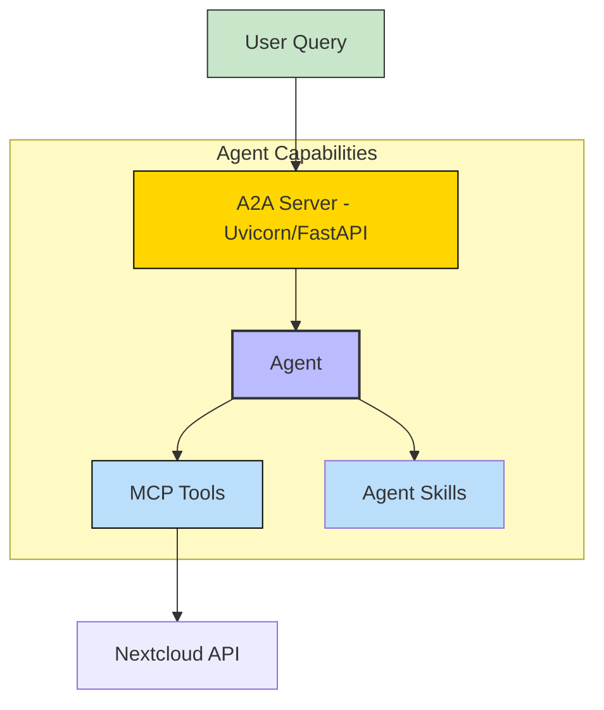
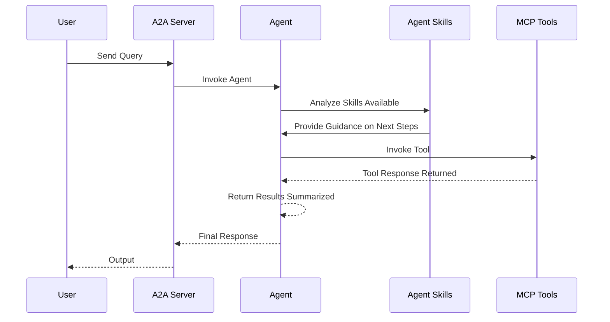
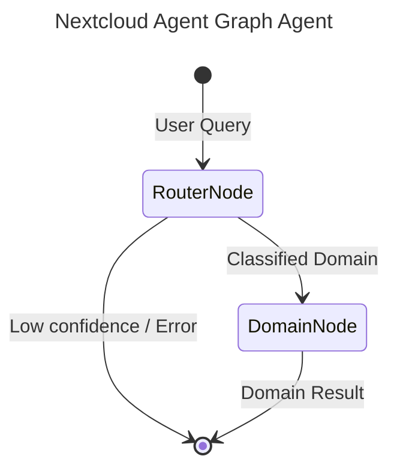

# Nextcloud - A2A | AG-UI | MCP


*Version: 0.12.0*

## Overview

Nextcloud MCP Server + A2A Server

It includes a Model Context Protocol (MCP) server and an out of the box Agent2Agent (A2A) agent

Interacts with your self-hosted Nextcloud instance to manage files, calendars, contacts, and sharing through an MCP server!

This repository is actively maintained - Contributions are welcome!

### Supports:
- **File Operations**: List, Read, Write, Move, Copy, Delete, Create Folder, Get Properties
- **Sharing**: List Shares, Create Share, Delete Share
- **Calendars**: List Calendars, List Events, Create Event
- **Contacts**: List Address Books, List Contacts, Create Contact
- **User Info**: Get current user details

## MCP

### Available MCP Tools

This server utilizes dynamic Action-Routed tools to optimize token overhead and maximize IDE compatibility.

| Tool Name | Description |
|-----------|-------------|
| `nextcloud_calendar` | Consolidated Action-Routed tool for calendar. Methods: list_calendars, list_calendar_events, create_calendar_event |
| `nextcloud_contacts` | Consolidated Action-Routed tool for contacts. Methods: list_address_books, list_contacts, create_contact |
| `nextcloud_files` | Consolidated Action-Routed tool for files. Methods: list_files, list_files, read_file, write_file, create_folder, delete_item, move_item, copy_item, get_properties |
| `nextcloud_sharing` | Consolidated Action-Routed tool for sharing. Methods: list_shares, create_share, delete_share |
| `nextcloud_user` | Consolidated Action-Routed tool for user. Methods: get_user_info |

## A2A Agent

This package also includes an A2A agent server that can be used to interact with the Nextcloud MCP server.

### Architecture:



### Component Interaction Diagram




## Graph Architecture

This agent uses `pydantic-graph` orchestration for intelligent routing and optimal context management.



- **RouterNode**: A fast, lightweight LLM (e.g., `nvidia/nemotron-3-super`) that classifies the user's query into one of the specialized domains.
- **DomainNode**: The executor node. For the selected domain, it dynamically sets environment variables to temporarily enable ONLY the tools relevant to that domain, creating a highly focused sub-agent (e.g., `gpt-4o`) to complete the request. This preserves LLM context and prevents tool hallucination.

## Usage

### MCP CLI

| Short Flag | Long Flag                          | Description                                                                 |
|------------|------------------------------------|-----------------------------------------------------------------------------|
| -h         | --help                             | Display help information                                                    |
| -t         | --transport                        | Transport method: 'stdio', 'http', or 'sse' [legacy] (default: stdio)       |
| -s         | --host                             | Host address for HTTP transport (default: 0.0.0.0)                          |
| -p         | --port                             | Port number for HTTP transport (default: 8016)                              |
|            | --auth-type                        | Authentication type: 'none', 'static', 'jwt', 'oauth-proxy', 'oidc-proxy', 'remote-oauth' (default: none) |
|            | --token-jwks-uri                   | JWKS URI for JWT verification                                              |
|            | --token-issuer                     | Issuer for JWT verification                                                |
|            | --token-audience                   | Audience for JWT verification                                              |
|            | --oauth-upstream-auth-endpoint     | Upstream authorization endpoint for OAuth Proxy                             |
|            | --oauth-upstream-token-endpoint    | Upstream token endpoint for OAuth Proxy                                    |
|            | --oauth-upstream-client-id         | Upstream client ID for OAuth Proxy                                         |
|            | --oauth-upstream-client-secret     | Upstream client secret for OAuth Proxy                                     |
|            | --oauth-base-url                   | Base URL for OAuth Proxy                                                   |
|            | --oidc-config-url                  | OIDC configuration URL                                                     |
|            | --oidc-client-id                   | OIDC client ID                                                             |
|            | --oidc-client-secret               | OIDC client secret                                                         |
|            | --oidc-base-url                    | Base URL for OIDC Proxy                                                    |
|            | --remote-auth-servers              | Comma-separated list of authorization servers for Remote OAuth             |
|            | --remote-base-url                  | Base URL for Remote OAuth                                                  |
|            | --allowed-client-redirect-uris     | Comma-separated list of allowed client redirect URIs                       |
|            | --eunomia-type                     | Eunomia authorization type: 'none', 'embedded', 'remote' (default: none)   |
|            | --eunomia-policy-file              | Policy file for embedded Eunomia (default: mcp_policies.json)              |
|            | --eunomia-remote-url               | URL for remote Eunomia server                                              |


### A2A CLI
#### Endpoints
- **Web UI**: `http://localhost:9016/` (if enabled)
- **A2A**: `http://localhost:9016/a2a` (Discovery: `/a2a/.well-known/agent.json`)
- **AG-UI**: `http://localhost:9016/ag-ui` (POST)

| Short Flag | Long Flag         | Description                                                            |
|------------|-------------------|------------------------------------------------------------------------|
| -h         | --help            | Display help information                                               |
|            | --host            | Host to bind the server to (default: 0.0.0.0)                          |
|            | --port            | Port to bind the server to (default: 9016)                             |
|            | --reload          | Enable auto-reload                                                     |
|            | --provider        | LLM Provider: 'openai', 'anthropic', 'google', 'huggingface'           |
|            | --model-id        | LLM Model ID (default: nvidia/nemotron-3-super)                                  |
|            | --base-url        | LLM Base URL (for OpenAI compatible providers)                         |
|            | --api-key         | LLM API Key                                                            |
|            | --mcp-url         | MCP Server URL (default: http://localhost:8016/mcp)                    |
|            | --web             | Enable Pydantic AI Web UI                                              | False (Env: ENABLE_WEB_UI) |


### Using as an MCP Server
The MCP Server can be run in two modes: `stdio` (for local testing) or `http` (for networked access). To start the server, use the following commands:

#### Run in stdio mode (default):
```bash
nextcloud-agent --transport "stdio"
```

#### Run in HTTP mode:
```bash
nextcloud-agent --transport "http"  --host "0.0.0.0"  --port "8016"
```

AI Prompt:
```text
List all files in my 'Documents' folder.
```

AI Response:
```text
Contents of 'Documents':
[FILE] Project_Proposal.docx (Size: 15403, Modified: Sun, 01 Feb 2026 10:00:00 GMT)
[FILE] Notes.txt (Size: 450, Modified: Sun, 01 Feb 2026 09:30:00 GMT)
[DIR] Financials (Size: -, Modified: Fri, 30 Jan 2026 14:20:00 GMT)
```

### Agentic AI
`nextcloud-agent` is designed to be used by Agentic AI systems. It provides a set of tools that allow agents to manage Nextcloud resources.

## Agent-to-Agent (A2A)

This package also includes an A2A agent server that can be used to interact with the Nextcloud MCP server.

### CLI

| Argument          | Description                                                    | Default                        |
|-------------------|----------------------------------------------------------------|--------------------------------|
| `--host`          | Host to bind the server to                                     | `0.0.0.0`                      |
| `--port`          | Port to bind the server to                                     | `9016`                         |
| `--reload`        | Enable auto-reload                                             | `False`                        |
| `--provider`      | LLM Provider (openai, anthropic, google, huggingface)          | `openai`                       |
| `--model-id`      | LLM Model ID                                                   | `nvidia/nemotron-3-super`                |
| `--base-url`      | LLM Base URL (for OpenAI compatible providers)                 | `http://ollama.arpa/v1`        |
| `--api-key`       | LLM API Key                                                    | `ollama`                       |
| `--mcp-url`       | MCP Server URL                                                 | `http://nextcloud-mcp:8016/mcp`  |
| `--allowed-tools` | List of allowed MCP tools                                      | `list_files`, `...`            |

### Examples

#### Run A2A Server
```bash
nextcloud-agent --provider openai --model-id gpt-4 --api-key sk-... --mcp-url http://localhost:8016/mcp
```

#### Run with Docker
```bash
docker run -e CMD=nextcloud-agent -p 9016:9016 nextcloud-agent
```

## Docker

### Build

```bash
docker build -t nextcloud-agent .
```

### Run MCP Server

```bash
docker run -p 8016:8016 nextcloud-agent
```

### Run A2A Server

```bash
docker run -e CMD=nextcloud-agent -p 9016:9016 nextcloud-agent
```

### Deploy MCP Server as a Service

The Nextcloud MCP server can be deployed using Docker, with configurable authentication, middleware, and Eunomia authorization.

#### Using Docker Run

```bash
docker pull knucklessg1/nextcloud-agent:latest

docker run -d \
  --name nextcloud-agent \
  -p 8016:8016 \
  -e HOST=0.0.0.0 \
  -e PORT=8016 \
  -e TRANSPORT=http \
  -e AUTH_TYPE=none \
  -e EUNOMIA_TYPE=none \
  -e NEXTCLOUD_BASE_URL=https://cloud.example.com \
  -e NEXTCLOUD_USERNAME=user \
  -e NEXTCLOUD_PASSWORD=pass \
  knucklessg1/nextcloud-agent:latest
```

For advanced authentication (e.g., JWT, OAuth Proxy, OIDC Proxy, Remote OAuth) or Eunomia, add the relevant environment variables:

```bash
docker run -d \
  --name nextcloud-agent \
  -p 8016:8016 \
  -e HOST=0.0.0.0 \
  -e PORT=8016 \
  -e TRANSPORT=http \
  -e AUTH_TYPE=oidc-proxy \
  -e OIDC_CONFIG_URL=https://provider.com/.well-known/openid-configuration \
  -e OIDC_CLIENT_ID=your-client-id \
  -e OIDC_CLIENT_SECRET=your-client-secret \
  -e OIDC_BASE_URL=https://your-server.com \
  -e ALLOWED_CLIENT_REDIRECT_URIS=http://localhost:*,https://*.example.com/* \
  -e EUNOMIA_TYPE=embedded \
  -e EUNOMIA_POLICY_FILE=/app/mcp_policies.json \
  -e NEXTCLOUD_BASE_URL=https://cloud.example.com \
  -e NEXTCLOUD_USERNAME=user \
  -e NEXTCLOUD_PASSWORD=pass \
  knucklessg1/nextcloud-agent:latest
```

#### Using Docker Compose

Create a `docker-compose.yml` file:

```yaml
services:
  nextcloud-mcp:
    image: knucklessg1/nextcloud-agent:latest
    environment:
      - HOST=0.0.0.0
      - PORT=8016
      - TRANSPORT=http
      - AUTH_TYPE=none
      - EUNOMIA_TYPE=none
      - NEXTCLOUD_BASE_URL=https://cloud.example.com
      - NEXTCLOUD_USERNAME=user
      - NEXTCLOUD_PASSWORD=pass
    ports:
      - 8016:8016
```

For advanced setups with authentication and Eunomia:

```yaml
services:
  nextcloud-mcp:
    image: knucklessg1/nextcloud-agent:latest
    environment:
      - HOST=0.0.0.0
      - PORT=8016
      - TRANSPORT=http
      - AUTH_TYPE=oidc-proxy
      - OIDC_CONFIG_URL=https://provider.com/.well-known/openid-configuration
      - OIDC_CLIENT_ID=your-client-id
      - OIDC_CLIENT_SECRET=your-client-secret
      - OIDC_BASE_URL=https://your-server.com
      - ALLOWED_CLIENT_REDIRECT_URIS=http://localhost:*,https://*.example.com/*
      - EUNOMIA_TYPE=embedded
      - EUNOMIA_POLICY_FILE=/app/mcp_policies.json
      - NEXTCLOUD_BASE_URL=https://cloud.example.com
      - NEXTCLOUD_USERNAME=user
      - NEXTCLOUD_PASSWORD=pass
    ports:
      - 8016:8016
    volumes:
      - ./mcp_policies.json:/app/mcp_policies.json
```

Run the service:

```bash
docker-compose up -d
```

#### Configure `mcp.json` for AI Integration

```json
{
  "mcpServers": {
    "nextcloud": {
      "command": "uv",
      "args": [
        "run",
        "--with",
        "nextcloud-agent"
      ],
      "env": {
        "NEXTCLOUD_BASE_URL": "https://cloud.example.com",
        "NEXTCLOUD_USERNAME": "user",
        "NEXTCLOUD_PASSWORD": "pass"
      },
      "timeout": 300000
    }
  }
}
```

## Install Python Package

```bash
python -m pip install nextcloud-agent
```
```bash
uv pip install nextcloud-agent
```

## Repository Owners


## MCP Configuration Examples

### 1. Standard IO (stdio) Deployment

```json
{
  "mcpServers": {
    "nextcloud-agent": {
      "command": "uv",
      "args": [
        "run",
        "nextcloud-mcp"
      ],
      "env": {
        "AGENT_DESCRIPTION": "<YOUR_AGENT_DESCRIPTION>",
        "AGENT_SYSTEM_PROMPT": "<YOUR_AGENT_SYSTEM_PROMPT>",
        "CALENDARTOOL": "True",
        "CONTACTSTOOL": "True",
        "DEFAULT_AGENT_NAME": "<YOUR_DEFAULT_AGENT_NAME>",
        "FILESTOOL": "True",
        "MISCTOOL": "True",
        "NEXTCLOUD_PASSWORD": "<YOUR_NEXTCLOUD_PASSWORD>",
        "NEXTCLOUD_SSL_VERIFY": "<YOUR_NEXTCLOUD_SSL_VERIFY>",
        "NEXTCLOUD_URL": "<YOUR_NEXTCLOUD_URL>",
        "NEXTCLOUD_USERNAME": "<YOUR_NEXTCLOUD_USERNAME>",
        "SHARINGTOOL": "True",
        "USERTOOL": "True"
      }
    }
  }
}
```

### 2. Streamable HTTP (SSE) Deployment

```json
{
  "mcpServers": {
    "nextcloud-agent": {
      "command": "uv",
      "args": [
        "run",
        "nextcloud-mcp",
        "--transport",
        "http",
        "--host",
        "0.0.0.0",
        "--port",
        "8000"
      ],
      "env": {
        "AGENT_DESCRIPTION": "<YOUR_AGENT_DESCRIPTION>",
        "AGENT_SYSTEM_PROMPT": "<YOUR_AGENT_SYSTEM_PROMPT>",
        "CALENDARTOOL": "True",
        "CONTACTSTOOL": "True",
        "DEFAULT_AGENT_NAME": "<YOUR_DEFAULT_AGENT_NAME>",
        "FILESTOOL": "True",
        "MISCTOOL": "True",
        "NEXTCLOUD_PASSWORD": "<YOUR_NEXTCLOUD_PASSWORD>",
        "NEXTCLOUD_SSL_VERIFY": "<YOUR_NEXTCLOUD_SSL_VERIFY>",
        "NEXTCLOUD_URL": "<YOUR_NEXTCLOUD_URL>",
        "NEXTCLOUD_USERNAME": "<YOUR_NEXTCLOUD_USERNAME>",
        "SHARINGTOOL": "True",
        "USERTOOL": "True"
      }
    }
  }
}
```
